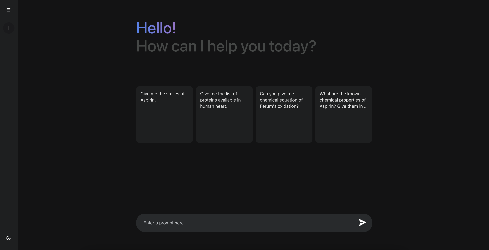

# AI Chat Wep App

The AI Chat App is an online platform that provides dynamic conversations powered by the Gemini API. Built with React, Redux, Node, and MongoDB, this tool allows users to engage in text-based dialogues with the Gemini AI.

## Live Demo

[https://deeporigin-gemini-1.onrender.com/](https://deeporigin-gemini-1.onrender.com/)



## Installation

### Server Side

1. Clone the repository:

   ```bash
   git clone https://github.com/shuvra-matrix/Gemini-Ai--MERN.git
   ```

2. Navigate to the server folder:

   ```bash
   cd ./server
   ```

3. Install dependencies:

   ```bash
   npm install
   ```

4. Set up environment variables in a `.env` file:

   ```
   MONGO_USER = mongodb_username
   MONGO_PASS = mongodb_password
   GEMINI_API_KEY = gemini_api_key
   CLIENT_API_KEY = server_client_verify_api_key(generate by user)
   CLIENT_REDIRECT_URL = http://localhost:3000
   ```

5. Run the server:

   ```bash
   npm start
   ```

### Client Side

1. Navigate to the public directory from root:

   ```bash
   cd public
   ```

2. Install client dependencies:

   ```bash
   npm install
   ```

3. Set up client-side environment variables in a `.env` file:

   ```
   REACT_APP_GEMINI_KEY = user_generated_key
   REACT_APP_SERVER_ENDPOINT = http://localhost:3030
   ```

4. Run the client:

   ```bash
   npm start
   ```
